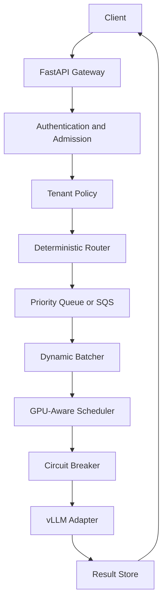
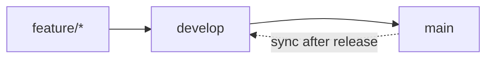

# Secure AI Inference Control Plane

A Python reference implementation of the control plane and execution policies behind a secure, multi-tenant AI inference service.

This project focuses on the platform behavior around model inference: admission control, tenant isolation, deterministic routing, batching, GPU-aware scheduling, failure containment, result tracking, reconciliation, auditability, and scaling decisions. It is an engineering prototype, not a production product or a complete retrieval-augmented generation application.

## Project status

The core policy modules and an in-process request lifecycle are implemented and covered by automated tests. An earlier revision of the service was successfully deployed and run on AWS. The current revision includes additional modules and a package rename, so its AWS deployment path needs to be revalidated after the remaining repository-level regressions are repaired.

Status as of September 8, 2026:

| Area | Current state |
| --- | --- |
| Core routing, batching, scheduling, resilience, and tenant policies | Implemented and unit tested |
| In-process gateway-to-worker lifecycle | Implemented and exercised by the unit suite |
| Unit suite | 238 passing tests |
| Statement coverage | 76% across `src/ai_inference` |
| Security scan | No medium- or high-severity Bandit findings |
| Local demo | Startup defect corrected in the development worktree; health, submission, processing, and result polling verified locally |
| Standalone integration suite | Not green; one test file is malformed and three health-monitoring tests require updates |
| AWS deployment | An earlier revision was deployed and run successfully; the current CDK entry point retains a pre-rename import and needs revalidation |
| GitHub Actions | Workflow is present but malformed on the default branch; there is not yet a successful CI run |
| Production readiness | Engineering prototype; prior deployment success does not establish production readiness for the current revision |

The immediate goal is repository hardening: repair CI and the CDK entry point, add a demo startup regression test, bring integration and quality checks to green, and publish reproducible evidence for those results.

## Why this project exists

AI prototypes often assume constant network access, abundant compute, and a direct request-to-model path. Secure enterprise and constrained environments introduce harder questions:

- How should the system reject work before overload becomes failure?
- How can model selection remain deterministic and explainable?
- How should latency, priority, and GPU capacity influence execution?
- How can one tenant be prevented from exhausting shared capacity?
- What happens when inference becomes slow, unavailable, or partially completes?
- How can operators reconstruct a request's lifecycle and safely recover stale work?

This repository explores those questions through explicit policies and replaceable interfaces. It favors observable decisions over opaque automation.

## Architecture



Supporting processes provide reconciliation, request TTL enforcement, audit events, metrics collection, and autoscaling decisions.

The gateway is the control-plane boundary. It validates and admits requests, applies tenant policy, records the routing decision, and places work on a queue. Workers own batching, capacity checks, inference execution, result persistence, and terminal lifecycle events.

## Implemented capabilities

### Gateway and policy enforcement

- FastAPI endpoints for submission, result polling, audit lookup, and health reporting
- Bearer API-key authentication with key-to-tenant mapping
- System-wide admission control based on queue depth and active request counts
- Per-tenant sliding-window rate limits, concurrency caps, and priority adjustment
- Idempotency-key derivation and request lifecycle initialization

### Explainable routing and execution

- Deterministic model selection with explicit reason codes
- Routing based on requested model, task type, context size, priority, and model limits
- Latency-aware avoidance after a configurable minimum sample count
- Conservative dynamic batching by model, event type, priority, token budget, and batchability
- GPU scheduling policy based on memory reserve, utilization, and model-specific batch limits
- Three priority lanes with FIFO ordering inside each lane

### Resilience and recovery

- Closed, open, and half-open circuit-breaker states
- Request TTL enforcement before inference
- Pending, processing, completed, and failed result states
- Reconciliation modes for observation, dry-run analysis, resubmission, and failure handling
- Optional Bedrock-assisted failure analysis and SNS notification interfaces
- Graceful worker shutdown and a runtime processing kill switch

### Observability and operations

- Structured JSON logging
- Request-level audit events
- JSONL and in-memory metrics sinks
- Queue wait, inference latency, throughput, failure, scheduling, and scaling metrics
- Streamlit metrics dashboard
- Autoscaling policy with log-only, ECS, and Auto Scaling Group executors

### AWS infrastructure definitions

The CDK stack models:

- A VPC with isolated subnets and selected VPC endpoints
- An encrypted SQS queue and dead-letter queue
- A KMS-encrypted DynamoDB result table with TTL and point-in-time recovery
- CloudWatch log groups, metrics, alarms, and dashboards
- Worker IAM permissions
- An SSM processing kill switch
- Site-to-site VPN resources

These definitions demonstrate infrastructure intent and build on a previously successful deployment. They should not be interpreted as proof that the current revision is deployable until CDK synthesis and deployment validation are restored in CI.

## Execution modes

| Mode | Purpose | Current verification |
| --- | --- | --- |
| In-memory components | Fast policy development and isolated tests | Verified by the passing unit suite |
| In-process lifecycle | Gateway, queue, worker, result store, audit, and metrics without AWS | Exercised by tests and a local submit-to-completion smoke test after the initialization fix |
| AWS-backed adapters | SQS, DynamoDB, CloudWatch, SNS, Bedrock, ECS, and ASG boundaries | Implemented; an earlier service revision was deployed successfully, while the current revision awaits revalidation |
| vLLM adapter | OpenAI-compatible private model endpoint | Implemented and tested with mocked HTTP/client behavior; current performance evidence is not included |

## Install and test locally

Requirements:

- Git
- Python 3.12
- [`uv`](https://docs.astral.sh/uv/)
- Optional: [`mise`](https://mise.jdx.dev/) for task aliases

Clone the repository and enter the project directory:

```bash
git clone https://github.com/JonCunninghamDev/ai-inference-project.git
cd ai-inference-project
```

Install the application and its runtime dependencies. `uv` creates and manages the project virtual environment automatically:

```bash
uv sync
```

Verify that the package imports successfully:

```bash
uv run python -c "import ai_inference; print('ai_inference installed successfully')"
```

Expected output:

```text
ai_inference installed successfully
```

### Run all unit tests

Install the test dependencies:

```bash
uv sync --extra test
```

Run the complete unit suite:

```bash
uv run pytest tests/unit -q
```

Expected result at the current commit:

```text
238 passed
```

To install the formatting, linting, type-checking, and test tools together instead:

```bash
uv sync --extra dev --extra test
```

### Generate a coverage report

Generate the locally verified coverage report:

```bash
uv run pytest tests/unit -q --cov=ai_inference --cov-report=term
```

Expected aggregate result at the current commit:

```text
TOTAL 2257 statements, 545 missed, 76% coverage
```

The repository also defines these `mise` tasks:

| Command | Intended purpose | Current state |
| --- | --- | --- |
| `mise run install` | Install development and test dependencies | Available |
| `mise run test` | Run `tests/unit` | Passing locally |
| `mise run lint` | Run Black and isort checks | Currently failing |
| `mise run demo` | Start the in-process platform | Verified locally after the development initialization-order fix |
| `mise run dashboard` | Start the Streamlit metrics dashboard | Implemented; expects a metrics JSONL file |

## Development workflow

The repository uses two long-lived branches:

| Branch | Role |
| --- | --- |
| `main` | Production history. Updated only by a release pull request from `develop`. |
| `develop` | Integration and test branch. Contains everything in `main` plus work intended for the next release. |

All normal changes are made on short-lived branches created from an up-to-date `develop` branch. Those branches are merged into `develop` through pull requests after automated checks pass. When a group of changes is ready for production, `develop` is merged into `main` through a release pull request.

Feature pull requests may be squash-merged into `develop`. Release pull requests from `develop` to `main` use a merge commit so the shared ancestry is preserved. After a release, `develop` is advanced to the resulting `main` commit before the next feature branch is created.



Direct feature commits to `main` or `develop` are avoided.

## API shape

The gateway exposes four primary endpoints:

| Method | Path | Purpose |
| --- | --- | --- |
| `POST` | `/v1/inference` | Validate, authorize, route, and enqueue a request |
| `GET` | `/v1/inference/{request_id}` | Retrieve request status or its terminal result |
| `GET` | `/v1/audit/{request_id}` | Retrieve recorded lifecycle events |
| `GET` | `/health` | Inspect service state, request counts, and admission status |

This is an asynchronous inference design. Accepted work returns a request ID and routing metadata; clients poll the result endpoint. Streaming and synchronous response paths are not currently implemented.

## Key design decisions

### Deterministic routing before learned routing

Every routing outcome includes a reason code and supporting notes. This makes behavior reproducible and debuggable while the platform policies are still evolving.

### Queue-based execution before synchronous inference

Separating intake from execution creates room for backpressure, priority, batching, retry behavior, recovery, and load shedding. The tradeoff is that clients need a polling or future event-delivery mechanism.

### SQS before Kafka

SQS provides durable queueing, retry behavior, and dead-letter handling without introducing a streaming platform. Kafka may be justified later if throughput, ordering, or replay requirements exceed the simpler queue model.

### Conservative batching before maximum utilization

Requests are grouped only when their model, event type, priority, token budget, and batching policy are compatible. This sacrifices some packing efficiency to keep execution rules predictable.

### Policy boundaries before live infrastructure discovery

GPU scheduling currently consumes supplied device snapshots. This keeps placement rules testable and allows live NVML or fleet inventory to be introduced without rewriting the scheduling policy.

### Automated recovery before operator notification

Reconciliation can inspect or heal stale requests before notifying an operator. Optional analysis and notification failures are treated as non-fatal so they do not prevent the reconciliation pass from completing.

## Security boundaries

The project includes security-oriented controls, but the word "secure" describes design intent rather than a certification or completed security assessment.

Implemented controls include:

- Gateway authentication and tenant derivation
- Per-tenant resource policies
- KMS encryption in the AWS infrastructure definitions
- Isolated-subnet infrastructure design
- Least-privilege-oriented IAM grants
- Append-only audit implementations
- A runtime kill switch
- Failure containment through circuit breaking and admission control

Current boundaries include:

- Authentication is API-key based; OAuth, workload identity, and mutual TLS are not implemented
- Demo mode intentionally uses a no-auth provider
- The repository has no formal threat model, penetration-test evidence, or compliance attestation
- An earlier AWS deployment succeeded, but the current revision has not been revalidated after the package rename and later module additions
- Bedrock failure analysis would require an explicit redaction and data-handling policy before use with sensitive records

## Known limitations

- The demo initialization-order regression must land with a regression test so startup remains verified.
- The CDK and legacy command entry points retain imports from the former `air_gapped_rag` package name.
- The GitHub Actions workflow and one older integration test were committed with escaped newline characters and cannot be parsed normally.
- Three health-monitoring integration tests have outdated worker configuration mocks.
- A top-level `pytest` invocation also collects `scripts/send_test.py`, which creates an AWS client during import.
- Black, isort, flake8, and mypy are not currently green as a combined quality gate.
- Reconciliation does not persist and faithfully replay the original request payload; its resubmission payload is synthetic.
- Deployed priority behavior is not yet mapped to separate SQS queues or FIFO message groups.
- Gateway and worker must be configured to use the same DynamoDB result table in a deployed environment; that path is not validated end to end.
- The repository does not retain current benchmark evidence for vLLM throughput, GPU placement, autoscaling, VPN connectivity, or failure-recovery behavior.

## Repository layout

```text
src/ai_inference/
├── core/            # worker, result lifecycle, reconciliation, metrics, audit, scaling
├── gateway/         # API, authentication, admission control, tenant policies
├── inference/       # routing, batching, GPU scheduling, latency, circuit breaker, vLLM adapter
├── infrastructure/  # AWS CDK stack
├── monitoring/      # worker health monitoring
├── dashboard.py     # Streamlit metrics dashboard
└── demo.py          # in-process demonstration wiring

tests/
├── unit/            # currently verified automated suite
└── integration/     # older standalone suite requiring repair
```

## Near-term hardening plan

1. Repair the GitHub Actions workflow and require a green pull-request check.
2. Complete the `air_gapped_rag` to `ai_inference` rename in every entry point and deployment artifact.
3. Add a regression test for interactive demo startup and the submit-to-completion path.
4. Repair or retire the older integration tests and make full test discovery safe.
5. Align Black, isort, flake8, and mypy configuration and bring the quality gate to green.
6. Validate CDK synthesis for development, staging, and production configurations.
7. Add deployment evidence or keep AWS resources explicitly labeled as unvalidated infrastructure definitions.

Longer-term enhancements include server-sent event streaming, stronger workload identity, faithful reconciliation replay, production priority queues, live GPU inventory, multi-region recovery, and load-test evidence.

## What this project demonstrates

- Designing an inference control plane rather than wrapping a model API
- Separating policy from infrastructure and external integrations
- Reasoning about capacity, fairness, failure, and recovery
- Building deterministic decisions that operators can inspect
- Designing testable seams around AWS services and model runtimes
- Documenting the difference between implemented code, locally verified behavior, and production evidence
