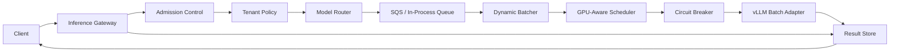
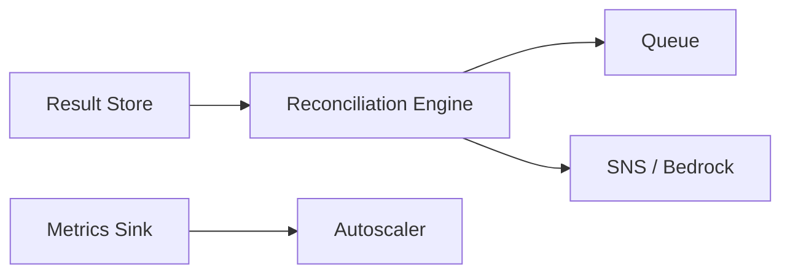

# Secure Inference Platform

Package name: `ai_inference`. Repository: `ai-inference`.

## Why this project exists

Many AI prototypes assume constant cloud access, abundant GPU capacity, and simple request paths. Those assumptions do not hold in secure enterprise, defense, critical infrastructure, or disconnected environments.

This project explores a harder pattern: how to run private AI workloads when data boundaries matter, network access may be constrained, and operators need observable, explainable, reliable inference behavior.

The goal is not just to answer questions over documents. The goal is to build the control plane and execution path for secure model serving.

## Design philosophy

The system is being built one module at a time. Each module answers a real platform question:

1. How should the platform choose a model for a request?
2. How should clients submit work without coupling directly to workers?
3. How should requests be batched without violating latency constraints?
4. How should GPU capacity affect scheduling decisions?
5. How should clients know when their work is done?
6. How should operators observe queue delay, model latency, failure rates, and throughput?
7. How should the system behave when part of the environment is degraded?

The project intentionally favors deterministic, explainable decisions over opaque magic. In secure systems, it is not enough for the platform to work. Operators need to understand why a request was routed, queued, retried, or rejected.

## Current architecture



Background processes:



The architecture separates the control plane from the execution plane. The gateway enforces system-wide and per-tenant limits before accepting work. The worker fleet uses GPU scheduling, circuit breaking, and concurrent batch inference. Background processes handle recovery and scaling.

## Demo mode

Run the entire platform in a single process with no AWS credentials, no Docker, and no GPU:

```bash
mise run demo
```

Then in another terminal:

```bash
# Submit a request
curl -s -X POST http://localhost:8080/v1/inference \
  -H "Content-Type: application/json" \
  -d '{"prompt": "Analyze this threat", "context": "Hostile actor near perimeter", "event_type": "security_review"}'

# Poll for result (use request_id from response above)
curl -s http://localhost:8080/v1/inference/{request_id}
```

Demo mode exercises the full lifecycle: gateway → routing → batching → GPU scheduling → mock inference → result retrieval. The in-process queue replaces SQS, and a shared in-memory result store replaces DynamoDB.

## Completed platform modules

### Module 1: Model Routing

Deterministic model routing with reason codes. The router considers explicit model requests, estimated context size, task type complexity, request priority, model context limits, and batching support. Every decision is inspectable.

### Module 2: Inference Gateway API

FastAPI control plane entry point. Accepts requests, validates shape, derives idempotency keys, runs routing before enqueueing, and returns the routing decision to the caller. Keeps request intake separate from private model execution.

### Module 3: Dynamic Batching

Deterministic batching planner between queue intake and model execution. Groups requests only when operationally compatible: same model, same event type, marked batchable, not high priority, within batch size and token budget limits.

### Module 4: GPU-Aware Scheduling

Capacity gate before batch execution. Models GPU device state, enforces memory reserve, utilization thresholds, and model-specific batch size limits. Defers work when capacity is unsafe. Uses config-fed snapshots with a clean policy boundary for later live inventory.

### Module 5: Result Store and Retrieval

Closes the async loop. Gateway marks requests as pending on acceptance. Worker updates status through processing → completed/failed. Clients poll `GET /v1/inference/{request_id}` for results.

Two implementations:
- `InMemoryResultStore` for local dev and demo mode
- `DynamoResultStore` for deployed environments (KMS-encrypted table with TTL and point-in-time recovery)

### Module 6: Reconciliation and Replay

Automated recovery for requests stuck in non-terminal states. Four configurable modes, all defaulting to disabled:

- **Dry Run** — scans and logs what would happen, changes nothing. Lets operators preview blast radius.
- **Heal** — resubmits stale pending requests to the queue; marks stale processing requests as failed.
- **Bedrock Analysis** — on unrecoverable failure, calls Claude to produce a structured root cause explanation for operators.
- **SNS Notification** — publishes to a topic only after all automated recovery is exhausted. Never fires for transient failures that self-heal.

Design constraint: Bedrock or SNS failures are non-fatal. Reconciliation always completes regardless of optional integration availability.

### Module 7: Structured Logging

JSON structured logger with `get_logger(component)`. All components emit single-line JSON with timestamp, level, component, message, plus arbitrary keyword fields. Per-component CloudWatch log groups in CDK.

### Module 8: Observability Metrics

JSONL metrics sink with per-event timing at every lifecycle point. Three sink implementations: `JsonlMetricsSink` (air-gapped file), `InMemoryMetricsSink` (testing/demo), `NullMetricsSink` (disabled). Events emitted at: request accepted, inference started/completed/failed, batch built, scheduling decision, reconciliation pass, queue wait time.

### Module 9: Admission Control

System-wide backpressure at the gateway. Checks pending/processing counts before accepting work. Returns 429 with Retry-After header when over threshold. Three rejection gates in priority order: queue depth → pending → processing.

### Module 10: Tenant-Aware Policies

Per-tenant sliding window rate limits, concurrency caps, and priority boost. One tenant hitting limits doesn’t block others. Tenant extracted from request metadata or auth-derived identity.

### Module 11: vLLM Batch Adapter

Concurrent batch inference via ThreadPoolExecutor to maximize server-side GPU batching. `InferenceAdapter` protocol boundary so the real vLLM client, a mock, or a future TensorRT-LLM backend can be swapped without changing worker logic.

### Module 12: Worker Pool Autoscaling

Scale-up triggers: queue wait time exceeds target, scheduling deferrals spike, utilization too high. Scale-down when workers idle beyond threshold. Cooldown prevents thrashing. Capped at min/max bounds. Dry-run by default.

### Module 13: Circuit Breaker

Three-state machine (closed → open → half-open) protecting downstream inference calls. Trips after N consecutive failures, fast-fails immediately when open, probes recovery after timeout. Manual reset for operator override.

### Module 14: Worker Execution Integration

Wires the circuit breaker and vLLM batch adapter into the production worker loop. The worker's `process_batch` method now:

1. Checks GPU scheduling (existing)
2. Gates on circuit breaker state — fast-fails the entire batch if open
3. Sends all batch items through the `InferenceAdapter` protocol concurrently
4. Records success/failure per item, updating circuit breaker state
5. Releases tenant concurrency slots on completion (automatic `tenant.release()`)

The demo worker uses the same pattern with `MockVllmAdapter` and a local circuit breaker. No separate mock inference path — both production and demo use the adapter protocol.

### Module 15: Audit Trail

Append-only lifecycle log for every request. Records transitions (accepted, routed, processing, completed, failed) with timestamp, component, and structured detail. Three implementations:

- `InMemoryAuditLog` — for dev and demo mode
- `JsonlAuditLog` — append-only local file, air-gapped compatible
- `NullAuditLog` — when auditing is disabled

Gateway emits `accepted` events. Worker emits `completed` and `failed` events. The trail for any request is retrievable by ID for debugging or compliance review.

### Module 16: Latency-Aware Routing

Closed-loop feedback from observed inference latency back into routing decisions. A `LatencyTracker` maintains a sliding window of per-model P95 latency. When the default model's P95 exceeds a configurable threshold, the router avoids it in favor of a non-degraded alternative — with an explicit `LATENCY_AVOIDANCE` reason code.

Design constraints:
- Explicit model requests, high-priority requests, and complex task routing are never overridden by latency
- If all models are degraded, the router falls through to the normal default (no infinite avoidance loop)
- The tracker requires a minimum sample count before judging (avoids cold-start false positives)
- Every latency-influenced decision is inspectable via the reason code and notes field

### Module 17: Priority Queues

FIFO with priority lanes so high-priority requests skip ahead of normal traffic. Three lanes (high/normal/low) with strict drain ordering. Priority mapping from the request priority field:

- Priority 1–2 → high lane
- Priority 3–7 → normal lane
- Priority 8–10 → low lane

FIFO ordering is preserved within each lane. The demo mode publisher routes requests into the correct lane based on their priority field. In production, this maps to separate SQS queues or FIFO message group IDs.

### Module 18: Gateway Authentication

API key authentication at the gateway before any admission or routing logic runs. Validates `Authorization: Bearer <key>` headers against a configured key-to-tenant mapping.

- `ApiKeyAuthProvider` — maps keys to tenant identities
- `NoAuthProvider` — allows all requests (demo mode)
- Auth-derived tenant identity takes precedence over metadata-supplied tenant
- Returns 401 Unauthorized for missing or invalid credentials
- Gate order: auth → admission → tenant policy → routing

### Module 19: End-to-End Integration Test

Proves the system works as a unit. A single test file starts all platform components in-process and exercises:

- Full lifecycle: submit → queue → process → poll result
- Priority ordering: high-priority requests processed first
- Auth rejection: invalid/missing keys return 401
- Audit trail population across gateway and worker
- Metrics emission at lifecycle points
- Routing decisions for complex vs simple tasks
- Batch processing of multiple requests
- Pending status before worker runs, 404 for unknown IDs

### Module 20: Reconciliation Scheduler

Background thread that runs the reconciliation engine on a fixed interval. Configurable interval, emits metrics per pass, graceful start/stop. Demo mode runs it in dry-run mode (logs stale requests but doesn't heal).

### Module 21: Audit Trail API

`GET /v1/audit/{request_id}` exposes the append-only lifecycle trail to operators without SSH access. Returns 404 for unknown requests.

### Module 22: Health Endpoint Enrichment

`GET /health` now includes pending/processing request counts and admission policy state. Gives operators immediate visibility into system load.

### Module 23: Request TTL

Auto-expires requests that exceed a configurable max age (default 300s). The worker checks TTL before inference — expired requests are marked failed, deleted from the queue, and emit an `expired` audit event. Prevents unbounded staleness.

### Module 24: Production Worker Wiring

The production worker now fully initializes from config:

- `DynamoResultStore` when a table name is configured (falls back to in-memory)
- `CircuitBreaker` with configurable failure threshold and recovery timeout
- `LatencyTracker` with configurable window size, P95 threshold, and min samples
- `RequestTTL` with configurable max age
- `VllmBatchAdapter` from vLLM URL config
- Latency observations fed back to the tracker on successful inference
- Router receives the latency tracker for latency-aware decisions

### Module 25: Autoscaler Executor

Executes scaling decisions produced by the Autoscaler. Three implementations:

- `LogOnlyExecutor` — logs decisions without acting (default/dry-run)
- `EcsScalingExecutor` — calls `update_service` on an ECS service
- `AsgScalingExecutor` — calls `set_desired_capacity` on an ASG

Protocol boundary means any compute backend can be plugged in.

### Module 26: Metrics Dashboard

Streamlit dashboard reading the JSONL metrics sink. Displays:

- Top-level KPIs: total requests, completed, failed, avg latency, req/min
- Latency distribution with P95
- Queue wait time over time
- Model and event type breakdown
- Throughput timeline (requests per minute)
- Circuit breaker transitions
- Scaling decisions

Works without AWS credentials. Demo mode writes to `metrics.jsonl` which the dashboard reads. Run with `mise run dashboard`.

## Infrastructure (CDK)

The CDK stack provisions:

- VPC with isolated subnets and PrivateLink endpoints (SQS, CloudWatch Logs, SSM)
- SQS inference queue with DLQ, KMS encryption
- DynamoDB result table with KMS encryption, PITR, TTL
- Per-component CloudWatch log groups (gateway, worker, reconciliation, scheduler) with appropriate retention
- CloudWatch dashboard, alarms (queue depth, DLQ, worker health)
- Worker IAM role with least-privilege grants
- SSM kill switch for runtime processing control
- Site-to-site VPN for secure connectivity

## Key tradeoffs

### Failure notification strategy

The reconciliation engine currently uses SNS as the notification channel for unrecoverable failures. This is a deliberate starting point, not a permanent commitment.

| Approach | Pros | Cons |
|----------|------|------|
| **SNS (current)** | Native AWS integration; fan-out to email, Lambda, SQS; already in CDK stack; cheap; only fires after all retries exhausted | Another failure mode if publish fails; requires subscription management; no rich context in email |
| **Sentry** | Structured error tracking with stack traces; deduplication; issue assignment; integrates with Slack/PagerDuty | External dependency; may not be available in air-gapped environments; cost at scale |
| **Direct Slack webhook** | Immediate visibility in team channels; rich message formatting; low latency | Tight coupling to a single notification channel; no fan-out; webhook rotation |
| **CloudWatch Alarm → SNS** | Metric-driven; threshold-based; native AWS | Requires custom metric emission; less context per alert; alarm fatigue risk |
| **EventBridge → multiple targets** | Decoupled event routing; rule-based filtering; multiple consumers | More infrastructure to manage; overkill for simple failure notification |

The right answer depends on the deployment environment. In a fully air-gapped network, SNS with an internal email relay may be the only option. In a connected enterprise environment, Sentry with Slack integration provides richer operator experience. The `SnsPublisher` protocol boundary means swapping the notification backend requires implementing one method — no reconciliation logic changes.

The key design constraint is unchanged regardless of backend: notifications fire only after automated recovery is exhausted. Transient failures that self-heal should never page an operator.

### SQS first, not Kafka first

SQS provides durable queueing, retries, and dead letter handling without introducing a full streaming platform too early. Kafka may make sense later for higher throughput or partitioned ordering.

### Deterministic routing first, not learned routing first

A learned routing policy might improve performance but would make the system harder to debug. Deterministic rules mean every decision is explainable.

### Async inference first, not synchronous inference first

Queue-based async inference gives the platform room for batching, scheduling, retries, and load shedding. A synchronous endpoint can be added later for low-latency use cases.

### Conservative batching first, not maximum packing first

Grouping by model and event type leaves some throughput on the table but protects correctness and keeps policy enforcement simpler.

### Config-fed GPU snapshots first, not full cluster orchestration first

Separating scheduling policy from inventory collection keeps the system testable and reasoning visible. Live NVML or fleet inventory can replace the data source without rewriting placement logic.

## Testing

```bash
mise run test
```

Current result:

```text
145 passed
```

Tests cover routing, gateway endpoints, admission control, tenant policies, vLLM batch adapter, autoscaling, circuit breaker, result store lifecycle, reconciliation modes, structured logging, metrics collection and sinks, batching rules, GPU scheduling, CDK assertions, worker health, config validation, and message processing.

## Running

| Command | What it does |
|---------|-------------|
| `mise run demo` | Full platform in demo mode (no AWS) |
| `mise run test` | Run unit tests |
| `mise run install` | Install deps (macOS/Linux, no GPU) |
| `mise run install:gpu` | Install with vLLM + CUDA (Linux only) |
| `mise run lint` | Run linters |

## Platform roadmap

Completed:

- Model Routing
- Inference Gateway API
- Dynamic Batching
- GPU-Aware Scheduling
- Result Store and Retrieval
- Reconciliation and Replay
- Structured Logging and Observability Infrastructure
- Quantitative Metrics (JSONL sink, per-event timing, queue wait, batch/scheduling metrics)
- Admission Control and Backpressure
- Tenant-Aware Policies
- vLLM Batch Inference Adapter
- Worker Pool Autoscaling
- Circuit Breaker
- Worker Execution Integration (circuit breaker + adapter wired into production loop)
- Audit Trail
- Latency-Aware Routing
- Priority Queues
- Gateway Authentication
- End-to-End Integration Test
- Reconciliation Scheduler
- Audit Trail API
- Health Endpoint Enrichment
- Request TTL
- Production Worker Wiring
- Autoscaler Executor
- Metrics Dashboard
- Demo Mode

The platform is feature-complete.

## What this project demonstrates

- Model serving architecture and control planes
- Async execution paths with durable queueing
- Routing and scheduling tradeoffs for constrained environments
- GPU capacity management as a first-class platform concern
- End-to-end request lifecycle with observable state
- Automated failure recovery with configurable modes
- Structured observability (JSON logs, per-component log groups, cross-request tracing)
- Secure environment constraints (KMS, VPC isolation, kill switches)
- Operationally grounded AI system design
