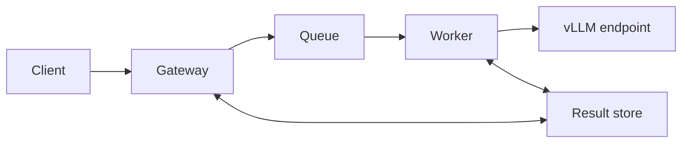

# Security design and current boundaries

This document describes the security behavior that is visible in the repository today. The project is a reference implementation, not a certified product or a completed security assessment. An earlier revision was deployed successfully, but the current revision has not been revalidated in AWS after the package rename and later module additions.

## Security posture at a glance

| Area | Current state |
| --- | --- |
| Gateway authentication | An API-key provider is implemented, but the application defaults to no authentication unless a provider is injected. Demo mode is intentionally unauthenticated. |
| Tenant controls | Authenticated identities can map to tenant IDs. In-process rate and concurrency limits are implemented per tenant. |
| Queue and result encryption | The CDK stack defines KMS encryption for SQS and DynamoDB, including KMS key rotation. |
| Network isolation | The CDK stack defines isolated subnets, selected VPC endpoints, and a site-to-site VPN. The endpoint set is currently incomplete for all worker dependencies. |
| Authorization | The worker role receives resource grants plus the AWS-managed `CloudWatchAgentServerPolicy`; the latter should be replaced or constrained before production use. |
| Audit trail | In-memory and JSONL audit sinks record lifecycle events. The JSONL file is not tamper-evident or protected from host-level modification. |
| Resilience controls | Admission control, request TTL, circuit breaking, a processing kill switch, a DLQ, alarms, and reconciliation policies are implemented. |
| Compliance | No compliance attestation, penetration-test report, or formal availability commitment is included in this repository. |

## Scope and trust boundaries

The logical request path is asynchronous:



This diagram shows software relationships, not a fully validated deployment topology. In particular, the CDK stack defines network, queue, result-store, monitoring, and worker-role resources, but it does not provision the gateway or worker compute.

The main trust boundaries are:

- The client-to-gateway boundary, where caller identity must be established.
- The gateway-to-queue boundary, where prompt, context, metadata, and routing information are serialized.
- The queue-to-worker boundary, where only expected message shapes should be accepted.
- The worker-to-model boundary, where request content is sent to the configured vLLM-compatible endpoint.
- The service-to-AWS boundary for SQS, DynamoDB, KMS, SSM, CloudWatch, SNS, ECS, ASG, and optional Bedrock integrations.

## Implemented application controls

### Authentication and tenant identity

[`ApiKeyAuthProvider`](../src/ai_inference/gateway/auth.py) validates a bearer token and maps it to a tenant ID. The gateway prefers this authenticated tenant identity over caller-supplied metadata.

Important limitations:

- [`create_app`](../src/ai_inference/gateway/api.py) falls back to `NoAuthProvider` when no provider is supplied. This is convenient for local use but is not a safe production default.
- Keys are supplied as an in-memory dictionary. Secret storage, hashing, expiration, rotation, revocation, and audit workflows are not implemented.
- OAuth, workload identity, and mutual TLS are not implemented.
- Tenant rate and concurrency state is local to one process; it is not coordinated across gateway replicas.

Any externally reachable deployment must inject a real authentication provider and fail startup if authentication configuration is absent.

### Admission, isolation, and failure containment

The application includes:

- Global admission control based on pending and processing load.
- Per-tenant sliding-window rate limits and concurrency limits.
- Auth-derived tenant identity when authentication is enabled.
- Request TTL checks before inference.
- A circuit breaker around the downstream model service.
- Deterministic routing and conservative batching policies.
- A worker processing switch read from SSM. If the switch cannot be read, the worker returns `False` and stops processing new work.
- Dead-letter queue and reconciliation boundaries for failed or stale work.

These controls reduce overload and failure propagation. They are not a substitute for authenticated ingress, distributed quotas, network policy, or resource-level authorization.

### Audit and observability

The gateway and worker record request lifecycle events without intentionally placing the original prompt or context in audit-event details. Structured application logs include request identifiers and operational metadata.

Two audit implementations are available:

- `InMemoryAuditLog` for tests and local demonstrations.
- `JsonlAuditLog` for appending events to a local file.

The JSONL sink uses append mode at the application layer only. It does not provide cryptographic integrity, access control, file locking, retention enforcement, secure rotation, or protection from deletion. It must not be described as an immutable compliance log without additional controls.

Errors can contain downstream or infrastructure details. Log destinations, retention, access, and redaction rules must be reviewed before processing sensitive data.

## Data handling

An inference request can contain:

- `prompt` and optional `context` content.
- Caller metadata and an event type.
- A tenant identity, selected model, priority, and routing details.
- A generated request ID and idempotency hash.

The gateway publishes this data to the queue. The worker sends prompt content to the configured model endpoint and writes request status, output, or error data to the result store. The CDK definitions enable KMS encryption for SQS and DynamoDB, but that infrastructure behavior still requires successful synthesis and deployment validation.

Optional Bedrock failure analysis is disabled by default. When enabled, it sends failure metadata—including request ID, timestamps, model name, and the recorded error—to the configured Bedrock model. It does not include the original prompt or context in the analysis request, but error text may still be sensitive and requires a documented data-handling policy.

The repository does not currently define:

- A data classification or acceptable-use policy.
- Prompt or result retention requirements.
- Field-level encryption or application-managed envelope encryption.
- A deletion workflow for an individual tenant or request.
- A verified redaction or data-loss-prevention layer.

## AWS infrastructure definitions

[`ai_inference_stack.py`](../src/ai_inference/infrastructure/ai_inference_stack.py) defines the following security-relevant resources:

- A customer-managed KMS key with automatic key rotation.
- KMS-encrypted inference and dead-letter SQS queues.
- A KMS-encrypted DynamoDB result table with TTL and point-in-time recovery.
- Private isolated subnets with no NAT gateway configured by the stack.
- Interface endpoints for SQS, CloudWatch Logs, and SSM.
- An endpoint security group that accepts TCP 443 only from the VPC CIDR and disables unrestricted outbound access.
- Stage-specific CloudWatch log retention and alarms.
- An SSM processing switch.
- A worker role with queue, table, key, log, switch, and metric permissions.
- Site-to-site VPN resource definitions.

These are infrastructure-as-code definitions, not evidence that the controls are active in an account. The current CDK entry point still contains stale imports, so synthesis and deployment must be repaired and tested before relying on the stack.

### Infrastructure issues requiring remediation

The current definitions must not be deployed unchanged to production:

1. The VPN pre-shared key is a hard-coded placeholder. Replace it with a secret-managed value that is not committed to source or exposed in a generated template.
2. `cdk.json` contains a specific home IP address. Supply environment-specific network values through a protected deployment configuration instead.
3. Isolated workers need private access to every required AWS API. The stack currently lacks DynamoDB and KMS endpoints, and any optional AWS integrations need corresponding endpoints or an explicitly approved egress path.
4. The AWS-managed `CloudWatchAgentServerPolicy` is broader than the resource-specific grants used elsewhere. Replace it with a scoped policy based on observed worker requirements.
5. CloudWatch log groups have retention settings but no customer-managed KMS key in this stack.
6. The stack does not provision authenticated TLS ingress, WAF protections, compute hardening, CloudTrail, GuardDuty, or centralized security-alert routing.
7. The site-to-site VPN definition alone does not prove end-to-end isolation, tunnel health, route correctness, or client authorization.

## Threat model summary

This is a working threat summary, not a formal threat model.

| Threat | Existing mitigation | Remaining exposure |
| --- | --- | --- |
| Unauthorized request submission | Injectable API-key provider | No-auth is the default; no secret lifecycle or workload identity |
| Tenant spoofing | Auth-derived tenant takes precedence | Metadata fallback remains when no authenticated tenant is present |
| Noisy-neighbor exhaustion | Admission, tenant rate, and concurrency limits | State is in-process and not shared across replicas |
| Queue or result disclosure | KMS-enabled SQS and DynamoDB definitions | Current infrastructure is not synthesis/deployment validated |
| Downstream model outage | Circuit breaker, retries, TTL, DLQ, reconciliation | Recovery behavior is not validated against a live current deployment |
| Sensitive data in telemetry | Audit details omit prompt and context | Error strings and other logs lack a verified redaction policy |
| Audit tampering | Append-oriented JSONL API | Local files are mutable and have no integrity chain |
| Network bypass or unintended egress | Isolated-subnet design and selected endpoints | Endpoint coverage and deployed routes are not currently validated |
| Compromised worker credentials | Resource grants for core AWS resources | Broad managed policy remains; no documented credential-response procedure |
| Dependency or source compromise | Lockfile-based installation and unit tests | Automated SCA, secret scanning, provenance, and signed releases are not established |

## Security verification

Install the development and test dependencies:

```bash
./scripts/install_dependencies.sh
```

Run the verified unit suite:

```bash
./scripts/run_unit_tests.sh
```

Run the current static security check:

```bash
uv run bandit -r src -ll
```

At the time of this documentation update, the unit command passes 238 tests and Bandit reports no medium- or high-severity findings. Those results are a narrow baseline, not proof of production security. The repository does not currently include a passing full integration suite, dynamic application security testing, infrastructure policy checks, a penetration-test report, or a formal security review.

## Production-readiness checklist

Before exposing the service outside a trusted development environment:

- Make authentication mandatory outside demo mode and load credentials from an approved secret store.
- Remove committed network-specific values and the VPN pre-shared-key placeholder.
- Repair the CDK entry point, synthesize every environment, review the generated IAM and network policies, and deploy to a disposable test account first.
- Add all required VPC endpoints or document and restrict each approved egress path.
- Replace broad managed permissions with scoped policies.
- Terminate TLS at an authenticated ingress layer and define request-size, timeout, and abuse protections.
- Define data classification, retention, deletion, redaction, and incident-response procedures.
- Send security-relevant logs to a protected, access-controlled, integrity-preserving destination.
- Enable account-level audit and detection services appropriate to the deployment.
- Add secret scanning, dependency vulnerability scanning, infrastructure policy checks, integration tests, and negative authentication tests to CI.
- Perform a threat-model review and an independent security assessment before processing sensitive or regulated data.

## Reporting a vulnerability

Do not publish sensitive exploit details in a general issue. Use a private GitHub security advisory for this repository if that feature is enabled, and include the affected component, reproduction steps, impact, and any suggested mitigation. No response-time or remediation-time SLA is currently claimed.
